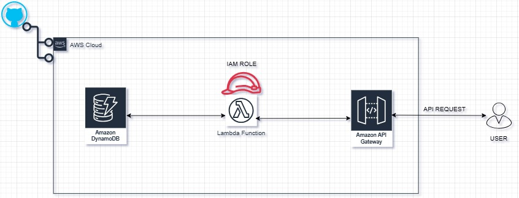

# PYTHON URL SHORTENER
## OVERVIEW


A simple URL shortener application built using Python, FastAPI, Docker, AWS Lambda, and AWS DynamoDB. This project shortens long URLs and stores the original and short URLs in DynamoDB for easy retrieval. The application provides a RESTful API that allows users to shorten a URL and view all shortened URLs in the database.

## Features

- Shorten URLs via a REST API.
- View all shortened URLs from DynamoDB.
- Deployable on AWS Lambda.
- Infrastructure provisioning with Terraform.
- CI/CD pipeline with GitHub Actions for automated deployment.

## Technologies Used

- **Python** - The backend logic is written in Python using FastAPI for building the API.
- **FastAPI** - A modern Python framework for building APIs quickly.
- **Docker** - Used to containerize the application and its dependencies.
- **Terraform** - Used for infrastructure provisioning on AWS.
- **GitHub Actions** - CI/CD for automated testing and deployment.

## Getting Started

### Prerequisites

Make sure you have the following installed:

- [Python 3.8+](https://www.python.org/downloads/)
- [Docker](https://www.docker.com/get-started)
- [Terraform](https://www.terraform.io/downloads)
- [AWS CLI](https://aws.amazon.com/cli/)
- [Git](https://git-scm.com/)

### Setup and Installation

#### 1. Clone the repository

```bash
git clone https://github.com/Stefanie-A/python-uri-shortener.git
cd python-url-shortener
```

#### 2. Install dependencies

You can install the necessary dependencies using `pip`:

```bash
pip install -r requirements.txt
```

#### 3. Set up AWS DynamoDB

Make sure your AWS credentials are configured properly and you have created a DynamoDB table for storing URLs.

You can do this manually via the AWS Management Console or using Terraform:

```bash
terraform init
terraform apply
```

#### 4. Run the app locally

To run the app locally with Docker, build the Docker image:

```bash
docker build -t python-uri-shortener .
```

Then, run the Docker container:

```bash
docker run -p 8000:8000 python-uri-shortener
```

You can now access the app by visiting `http://localhost:8000` in your browser.

#### 5. Running the tests

You can run tests to ensure everything is functioning properly:


### API Endpoints

#### Shorten a URL

**POST** `/shorten`

- Request body:

```json
{
  "original_url": "https://example.com"
}
```

- Response:

```json
{
  "shortened_url": "https://short.ly/abc123"
}
```

#### View all shortened URLs

**GET** `/urls`

- Response:

```json
[
  {
    "original_url": "https://example.com",
    "shortened_url": "https://short.ly/abc123"
  },
  {
    "original_url": "https://anotherexample.com",
    "shortened_url": "https://short.ly/def456"
  }
]
```

## License

This project is licensed under the MIT License - see the [LICENSE](LICENSE) file for details.

---

Feel free to adjust the details based on any specific configurations or extra steps related to your project.